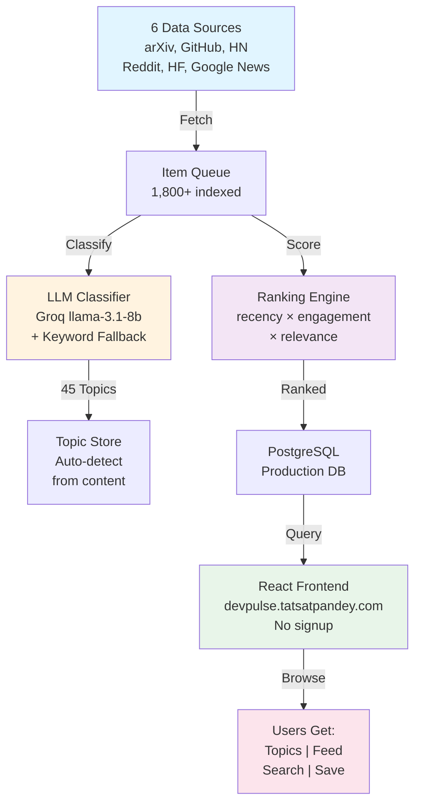

# 🚀 DevPulse Launch — COMPLETE (With Architecture + Demo)

Your launch post with visual proof. Copy-paste ready.

---

## 🎯 THE LAUNCH POST (Updated)

```
I built DevPulse because I was drowning in AI news.

Newsletters were too slow. Twitter was too noisy. Reddit was scattered.

So I aggregated 6 sources (arXiv, GitHub Trending, Hacker News, Reddit, HuggingFace, Google News) 
and ranked them by signal, not recency. No account needed. No algorithm. Just the best AI dev news in one place.

45 topics tracked. 1,800+ items indexed. 197 sources live.

The problem: most developers have NO single source of truth for AI development. 
Papers are on arXiv. Code is on GitHub. Community insights are on Reddit. 
News is scattered. By the time you've checked everywhere, 2 hours are gone.

The solution: one ranked feed. Built with Bun + React + PostgreSQL. 
Runs on Render free tier.

📊 How it works:
• Fetch from 6 sources every 2-6 hours
• Classify with LLM (Groq) + keyword fallback
• Rank by: recency × engagement × topic relevance
• Display in a clean feed (no algorithm, no noise)

[GIF: Screen recording showing feed, topics, search]

Try it now: devpulse.tatsatpandey.com

No signup. No tracking. No ads. Just signal.

Feedback welcomed. I'm reading every message.

#AI #MachineLearning #Startup #BuildInPublic #DevTools #OpenSource
```

---

## 🏗️ ARCHITECTURE DIAGRAM (Add to LinkedIn/Reddit/HN)

Use this when posting:

```
┌──────────────────────────────────────────────────────────┐
│                     DevPulse Pipeline                    │
└──────────────────────────────────────────────────────────┘

1️⃣  FETCH (Every 2-6 hours)
    ↓
    arXiv (papers) → GitHub (repos) → HN (discussions)
    Reddit (posts) → HuggingFace (models) → Google News (articles)

2️⃣  CLASSIFY (LLM + Fallback)
    ↓
    Groq (llama-3.1-8b): "Is this about LLMs? MLOps? Safety?"
    Keyword fallback: If LLM fails, match against 45 topics

3️⃣  SCORE
    ↓
    Points = (recency × 0.2) + (engagement × 0.6) + (topic_match × 0.2)
    Higher score = appears higher in feed

4️⃣  DISPLAY
    ↓
    One ranked feed. Browse by topic. Search. Save locally.
    No account. No algorithm. Just signal.

───────────────────────────────────────────────────────────
Tech: Bun + Express (backend) | React 19 + Vite (frontend)
      PostgreSQL (DB) | Groq (LLM) | Render (hosting)
```

**For visual architecture on LinkedIn:** Share as text-in-image or use the Mermaid diagram below.

---

## 📊 MERMAID ARCHITECTURE (Copy this for LinkedIn post as image)

If you want to create a professional-looking diagram, use [mermaid.live](https://mermaid.live) and paste this:



(Paste into [mermaid.live](https://mermaid.live), take screenshot, add to LinkedIn post)

---

## 🎥 GIF/VIDEO DEMO (What to Record)

### Option A: Quick GIF (15 seconds) — EASIEST
Record this flow:
```
1. Show homepage (intro)
2. Click "Feed" — scroll through 5 items
3. Click "Topics" — show topic cards
4. Click one topic — show filtered view
5. Show "Chat" tab briefly
6. Text overlay: "No signup. No ads. Just signal."
```

**Tools to create GIF:**
- Mac: QuickTime + Giphy
- Windows: ShareX or ScreenToGif (free)
- Online: [Gifcap.dev](https://gifcap.dev) (easiest)

**Size:** Keep under 5MB for Twitter/LinkedIn

### Option B: 30-second Video Demo
Same flow but smoother, add:
- Background music (royalty-free from YouTube Audio Library)
- Text overlays: "45 topics | 1,800+ items | 6 sources"
- Voiceover: "No newsletters. No noise. Just the best AI dev news."

**Upload to:** YouTube, Twitter, LinkedIn natively

### Option C: Static Screenshot (If video is too much)
Just screenshot the feed page with a good headline:
```
"One ranked feed of what matters in AI development."
[Feed screenshot showing 5 diverse items]
```

---

## 📋 WHERE TO ADD DEMO

### LinkedIn Post
```
Text post with the launch post above +
[Screenshot or GIF of feed]
```

### Twitter/X
```
Tweet 1: Text hook + link
Tweet 2 (reply): "Here's how it works:" + GIF showing feed
Tweet 3 (reply): Architecture diagram
```

### Reddit
```
Text post with full explanation +
GIF embedded in post body +
Link to demo at bottom
```

### Hacker News
```
URL: devpulse.tatsatpandey.com
First comment: Include description + link to demo video
```

---

## 🎬 RECORD YOUR GIF IN 5 MINUTES

### Using ShareX (Windows):
```
1. Install ShareX (free)
2. Start recording (Shift+PrintScreen)
3. Do your demo (15 sec)
4. Stop recording → Save as GIF
5. Upload to post
```

### Using Gifcap.dev (No install):
```
1. Go to gifcap.dev
2. Choose "Entire screen" or "Window"
3. Hit record
4. Do your demo
5. Stop → Download GIF
6. Post it
```

### Using QuickTime (Mac):
```
1. File → New Screen Recording
2. Record your demo (15 sec)
3. Export as MP4
4. Upload to Twitter/LinkedIn
```

---

## 📝 "HOW IT WORKS" COPY (For Comments/Replies)

Use this when someone asks how DevPulse works:

```
Great question! Here's the flow:

1️⃣  FETCH (2-6 hourly)
    Every morning, DevPulse pulls fresh items from 6 sources:
    • arXiv (new papers) • GitHub (trending repos)
    • Hacker News (discussions) • Reddit (community takes)
    • HuggingFace (models/spaces) • Google News (coverage)

2️⃣  CLASSIFY (Smart categorization)
    I use Groq's llama-3.1-8b to automatically classify each item 
    into one of 45 topics: "LLMs", "MLOps", "Safety", "Tools", etc.
    
    If LLM fails (rare), keyword matching kicks in.

3️⃣  SCORE (Rank by importance, not recency)
    Score = (time_decay × 0.2) + (engagement × 0.6) + (topic_match × 0.2)
    
    Example: A 2-week-old paper with 5k upvotes ranks higher than 
    yesterday's quiet release.

4️⃣  DISPLAY (One clean feed)
    Users see topics, browse feed, search, save locally.
    No algorithm rewarding time-on-site. No ads. No tracking.

Result: Instead of checking 6 places for AI news, you check one.
```

---

## ✅ LAUNCH CHECKLIST (Updated)

- [ ] Record 15-sec GIF of demo (use Gifcap.dev)
- [ ] Create architecture diagram screenshot (use mermaid.live)
- [ ] Update launch post to include: main text + GIF + link
- [ ] Add "How it works" to first HN comment
- [ ] Post on Hacker News (Wednesday 6am EST)
- [ ] Post on LinkedIn (Wednesday 1pm EST) — include screenshot
- [ ] Post on Reddit r/MachineLearning (Wednesday 9am EST)
- [ ] Post on Reddit r/LocalLLaMA (Wednesday 11am EST)
- [ ] Post on Twitter (Wednesday 8:30am EST) — use thread format
- [ ] Engage comments for 24 hours straight
- [ ] Pin the GIF/demo in comments

---

## 📊 SUCCESS METRICS (Updated)

| Metric | Target | Platform |
|--------|--------|----------|
| Views | 5k+ | Total |
| Clicks from social | 2k+ | Visits to site |
| Comments/Upvotes | 150+ | Combined |
| HN Rank | Top 10 | First day |
| Reddit Upvotes | 500+ | r/MachineLearning |
| Twitter Impressions | 10k+ | From threads |

---

## 🎯 FINAL LAUNCH POST (COMPLETE VERSION)

Copy-paste this entire thing for your main launch:

```
I built DevPulse because I was drowning in AI news.

Newsletters were too slow. Twitter was too noisy. Reddit was scattered.

So I aggregated 6 sources (arXiv, GitHub Trending, Hacker News, Reddit, HuggingFace, Google News) 
and ranked them by signal, not recency. No account needed. No algorithm. Just the best AI dev news.

45 topics tracked. 1,800+ items indexed. 197 sources live.

━━━━━━━━━━━━━━━━━━━━━━━━━━━━━━━━━━━━━━━━━━━

💡 HOW IT WORKS

1. FETCH (every 2-6 hours)
   Pull from: arXiv papers, GitHub repos, HN discussions, Reddit posts, HF models, news

2. CLASSIFY (LLM + fallback)
   Groq llama-3.1-8b: "Is this about LLMs? Safety? Tools?"
   45 auto-detected topics

3. SCORE (rank by importance)
   Formula: (recency × 0.2) + (engagement × 0.6) + (topic_match × 0.2)
   A 2-week-old paper with 5k upvotes beats yesterday's quiet repo

4. DISPLAY (clean feed)
   One ranked view. Browse by topic. Search. No account. No ads.

━━━━━━━━━━━━━━━━━━━━━━━━━━━━━━━━━━━━━━━━━━━

Built with: Bun + React 19 + PostgreSQL + Groq LLM
Hosted on: Render free tier

Try it: devpulse.tatsatpandey.com

No signup. No tracking. No noise. Just signal.

[GIF: 15-sec demo of feed]

Feedback welcomed. Reading every message 🙏

#AI #MachineLearning #Startup #BuildInPublic #DevTools
```

---

## 🚀 YOU'RE READY

1. **Record GIF** (5 min with Gifcap.dev)
2. **Add to posts** (copy launch text above)
3. **Post to all platforms** (schedule for Wednesday)
4. **Engage** (respond to every comment)

**That's it. Launch time!** 🎉
